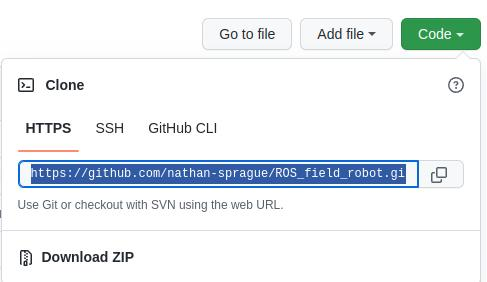
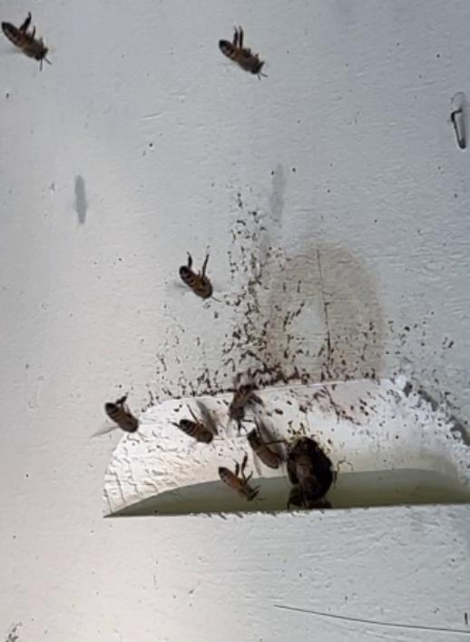
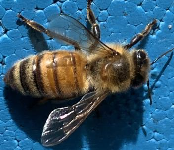
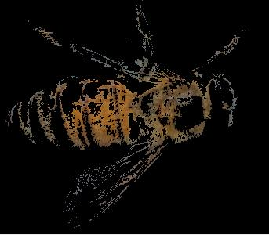
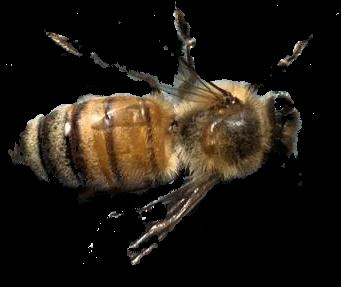
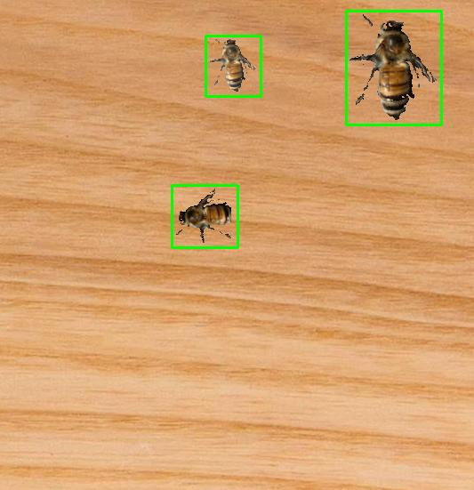
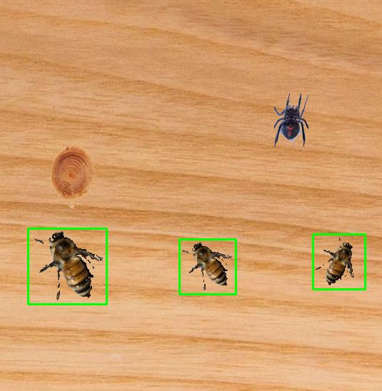

# ABE 590 Lab

# About this lab:
The first part of the lab requires using OpenCV's GUI, which is best done on your local machine, not from an online IDE, like Google Colab. The last part of the lab involving tensorflow, will be done on Google Colab.  

This readme file (written in Markdown) is best viewed from GitHub. It has instructions on what to do for each step.

It is reccomended to keep the Github page open as you do this lab. 

You will need to download this repository to access the template python files and images. Do this by pressing the drop green button saying "code" at the top of this webpage and then "download zip"
 

  

# Goal of the lab(s)
Count bees entering/exiting a hive using computer vision 
Using an video like this, we want to see as many bees as possible. 

 

# Introduction to OpenCV
## What is an image?
To the computer, images are just arrays.  
- A black and white image is a single 2D array
- Color images are 2D arrays with multiple channels, which are multiple 2D arrays displayed together
- The three color channels in a typical color image are red, green and blue. Together they make most colors a human can see
- There are other ways to represent an image, which we will get into later.

## What is OpenCV?
- OpenCV, or CV2, stands for Open Computer Vision.  
- It is a library for Python and C++
- It has been around since 2000 and is one of the most popular image processing libraries
- Images are numpy arrays. Numpy is another popular library for matrix operations

 

# Section 0: Setting up the environment
<b>1. Install Python 3</b>  
The specific python release doesn't matter, but 3.7 or greater is preferred.
You can check if you have python installed by typing in the terminal/command prompt:
> python3 --version

 
<b>2. Install pip </b>  
Google can give you better directions than me. It involves running the script <i>get-pip.py</i>.   
You can check if you have pip installed by typing in the terminal/command prompt:

> pip3 --version

 
<b>3. install OpenCV</b> 
In the terminal or command prompt, type:
> pip3 install opencv-python

If it installed correctly, you should be able to import OpenCV in Python. 
 
<b>4. Open python in an IDE.</b>  
Installing Python on windows comes with Python Idle. Visual Studio Code, Sublime Text,  PyCharm, and Spyder are good python IDEs. If you have prefer a specific IDE, feel free to use it. Otherwise we will be using Visual Studio Code (VS Code).

<b>4. If you haven't already, download this repository and open the code template (called labTemplate.py).</b>  

<b> 5. Verify the everything is working by running the file "codeTemplate.py"</b> 

The first time you try to open a Python file in VS Code, it will ask you if you would like to install the python extensions. Install them. 
Once it finishes installing, press the green arrow on the top right side of the window. If it shows an image of a bee, you are all set up! 

 

## How to use OpenCV effectively
Python by itself is slow. You can manipulate individual pixels using only Python, but Numpy and OpenCV functions are much faster. 
<b> 8. Compare the speed of running the code using python loops, nump array operations, and OpenCV functions</b>  

<b>Change the variable "partNum" at the top of codeTemplate.py to equal 1.</b> 
Look at the function "makeGrayscalePython" It goes through every pixel in the image and averages the red, green and blue values and puts it into the image.  
<b>Change the value in the code to give the resulting image pixel the average pixel values.</b> 
<b>Run the code and see the grayscale image. Take note of the runtime printed in the console.</b>  

<b>Change the variable "partNum" at the top of codeTemplate.py to equal 2.</b> 
Look at the function "makeGrayscaleNumpy" It makes a grayscale by taking a channel out and putting it in the image. 
<b>Run the code and see the grayscale image. Take note of the runtime printed in the console.</b>  

<b>Change the variable "partNum" at the top of codeTemplate.py to equal 2.</b> 
Look at the function "makeGrayscaleOpenCV" It makes a grayscale image using a builtin function.  
<b>Run the code and see the grayscale image. Take note of the runtime printed in the console.</b>  

# Section 1: Using OpenCV to detect bees using non-ML methods

## <b>BGR thresholding</b>
The most simple way of separating something from its background is finding the approximate color of the background and removing it. Try dong this to an image of a bee.

<b>Change the variable "partNum" at the top of the file to equal 1.</b> 
<b>9. In the function "bgrThreshold", try finding masking threshold values to remove the most of the background</b> 
- The three numbers represent blue, green and red. Since the image background is blue try setting the blue low threshold to be high and adjust the other values to avoid removing the bee's body.
- Removing the background is hard to do well. Try your best, but it's okay if you can't effectively remove most of the background.  

## <b>HSV thresholding</b>

Removing the background was hard using the BGR color format. Fortunately there are better ways to do it.

<b>Change the variable "partNum" to 2.</b> 
<b>10. In the funcion "hsvThreshold", try finding masking threshold values to remove most of the background again</b> 
- This is using HSV, or Hue, saturation and value. It separates color, so it should be much easier to eliminate the blue background.
- To see what the HSV image is, use add the line:
> cv2.imshow("hsv", hsv)
- Try to eliminate most of the background. We will be using this function in future steps.  

## <b>Limitations of color thresholding</b>
<b>Change the variable "partNum" to 2 and run the program</b> 
- This will execute the same function you made as before, but with the bee pasted on a wooden background. 
- Is your function still able to detect it? Probably not. We will use more robust methods to detect the bee on varying backgrounds.

## <b>Canny + dilation</b>

Since the background removal function doesn't work well with backgrounds similar to the bee's color, let's look at other options.

<b>Change the variable "partNum" to 3.</b> 
<b>11. Modify the two canny thresholds to have many lines where the bee is, and have few lines elsewhere</b> 
- OpenCV's Canny edge detection attempts to detect edges in the image. 
- We will try to detect distinguish between the bee (many color variations/edges) from the background (fewer color variations)
- Next, the function will dilate the edges and turn the edges into approximate shapes. 
- Any other edges detected in the image may be pixels. Don't worry about them. We will remove them later.

## <b>Detecting bees</b> 
Now that we have multiple bees in the image and we are able to remove the background around them, it is time to get their locations.  

<b>Change the variable "partNum" to 4</b>   

<b>12. Modify the variables "minArea" and "maxArea" to make a box around the bees</b>  

- OpenCV's findContours function looks for blob-like shapes in an image.
- You can filter the blobs by the general shape and size. Since bees can be in a variety of positions and orientations, we will only filter by the size of the shape.
- This should remove all of the specks 

## <b>Limitations of the detector</b> 
<b>Change the variable "partNum" to 5</b>   
- The detector we have detects everything that has lines and is in a certain size range.
- If there is anything else in the image, such as a spider, our detector will detect it as well.

## <b>Detecting bees with HSV thresholding</b>
To improve the accuracy, try combining two of the detection methods.

<b>Change the variable "partNum" to 6</b>  
<b>Change the variable "minPercentColor" to make the detector only detect bees and not the spider</b> 
- Fortunately, bees are a different color from the spider. Using the HSV thresholding function you wrote, we can differentiate between the spider and the bees
- If it is not able to differentiate between the two, you may need to modify your thresholds in the hsvThreshold function.

## <b>Limitations of the detector</b> 
<b>Change the variable "partNum" to 7</b>   
- This HSV thresholding might work for differentiating between black spiders and yellow bees, but what if there is a knot in the wood that is approximately the same color as the bees?

## Detecting bees with HSV thresholding + movement
<b>Change the variable "partNum" to 8</b>  
Look at the function detectBees3

<b>Change the variable "minPercentMovement" to make the detector only detect moving things</b> 
- Fortunately, a knot in the wood doesn't move.
- Combining the HSV thresholding from the previous detector with a movement detection, our detector will only detect moving objects the same color as bees. 

## Using the model with real images
We were testing the model on images on top of each other. Now see how the detector performs in real life.
<b>Change the variable "partNum" to 9</b>
- Notice that with a real video, the detector incorrectly identifes things often and misses most bees.
- You can try to modify the thresholds to make the detector work better, but it will still not be perfect.
- In the next section, we will look at how to use machine learning to detect the bees.  

  
# Section 2: Using OpenCV to detect bees using ML methods

## Making your own neural network (may add later)

## Labeling images
To train a model, you will need to label <i>many</i> images of the thing you want to detect. The more images you label, the better, but the minimum should be at least 50. 

For this lab, there are around 100 images of bees in the folder "bee_images" that you can label.

<b>Open the file "makeAnnotations.py" and run it.</b> 
It will show you one image at a time, make a bounding box around every bee that you see.
For best results, the bounding box should include as much of the bee as possible, with a small margin around the bee.

The controls for the annotator are:
- to create a bounding box around a bee, click and drag.
- to go to the previous image, press "j"
- to save the data press "s"
- to exit without saving, press the escape key
- to export the labeled data into training folders, press "p"
- to delete a mislabeled bounding box, click on it so it will turn green and press the backspace key.
- scroll to zoom in
- To go to the next image, press any other button.

Make annotations for every bee in every image. How well you annotate will affect how well the model will perform.

Once you finished making all the annotations, press the "p" key. It will generate two subfolders in the "bee_imgs" folders, called "train" and validate". Check to see that there are images and xml files inside each folder.

## Training with tensorflow
The remainder of this lab will be done on Google Colab, because it is often difficult to install the proper python libraries on your local computer. 
From here on, follow the instructions here:
https://colab.research.google.com/drive/1puIQb4vTK7aI7u2ow9fBsVpqXkP4HF2b?usp=sharing

## Training the model
(see google colab)
## Running the model
(see google colab)
## Comparing ML and non-ML methods (may add later)

## Using ML and non-ML methods together (may add later)
