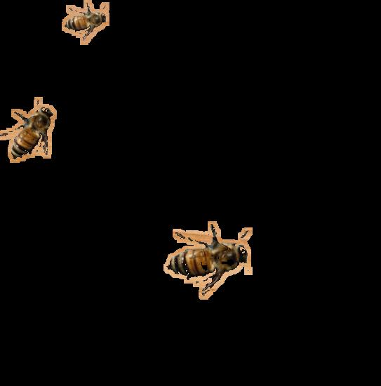

# ABE 590 Lab

# About this lab:
The first part of the lab requires using OpenCV's GUI, which is best done on your local machine, not from an online IDE, like Google Colab. The last part of the lab involving tensorflow, will be done on Google Colab.  

This readme file (written in Markdown) is best viewed from GitHub. It has instructions on what to do for each step.

It is reccomended to keep the Github page open as you do this lab. 

# Goal of the lab
Count bees entering/exiting a hive using computer vision 
Using an video like this, we see approximately how many bees there are. 

 

# Introduction to OpenCV
## What is an image?
To the computer, images are just arrays.  
- A black and white image is a single 2D array
- Color images are 2D arrays with multiple channels, which are multiple 2D arrays displayed together
- The three color channels in a typical color image are red, green and blue. Together they make most colors a human can see
- There are other ways to represent an image, which we will get into later.

## What is OpenCV?
- OpenCV, or CV2, stands for Open Computer Vision.  
- It is a library for Python and C++
- It has been around since 2000 and is one of the most popular image processing libraries
- Images are numpy arrays. Numpy is another popular library for matrix operations

 

# Section 0: Setting up the environment

:warning:
<b>This lab involves training computer vision models locally on a virtual machine, which can be demanding. Your computer's hardware may not be capable of doing this lab.</b>:warning:

These are the following specifications you computer should have:
- ability to download a 10GB file
- 15 GB of storage
- at least 8 GB RAM
- A CPU with at least 4 cores
- Administrative privilege to install an application 

For reference, this is about half the minimum requirements for Solidworks

You can check your computer's hardware opening the app "system information" and looking at the system summary page. 

## If you <u>do not</u> meet the system requirements
If you don't meet these requirements and are up for a challenge, you can install the same thing without a virtual machine by using following commands in a Debian-based linux terminal:
>sudo apt-get update 
sudo snap install --classic code 
git clone https://github.com/nathan-sprague/CV_lab.git 
sudo apt install python3-pip 
sudo add-apt-repository ppa:deadsnakes/ppa 
sudo apt install python3.9 
sudo apt install python3.9-dev 
apt-get install python3-virtualenv 
virtualenv -p /usr/bin/python3.9 venv 
source venv/bin/activate 
*see (venv) before green prompt* 
python3 --version 
sudo apt-get install python3.9-distutils 
pip3 install tflite-model-maker 
pip3 install tflite-support 
pip3 install opencv-python 

If you cannot install some of the things, try using Google. Good luck!

## If you <u>do</u> meet the system requirements
1. Download virtualbox from the following page
https://www.virtualbox.org/wiki/Downloads
    - Virtualbox 7 was released recently, but you might have trouble installing it. Use Virtualbox 6, it works the same.

2. Download the Virtualbox appliance (~10 GB)

3. Open Virtualbox and press file>import appliance 

4. Select the 10 GB virtualbox appliance you downloaded 

5. Chooose hardware settings. Pick an amount of ram and number of CPU cores that you would like. A safe amount would be around half of what your computer has. For example, if you have 16 GB of RAM and 12 cores, choose 8192 MB of RAM and 6 cores. You can change this later. 

6. Once it installs, there should be a virtual machine that shows up. Press the green arrow at the top 

7. It will boot into a new operating system. The password is: <i>lab</i>

8. Adjust the size of the display by clicking the start button in the bottom left corner, open the application "monitor settings" and picking an appropriate resolution.

9. Open the folder called lab.

10. Open the file called labTemplate.py. It will open into Sublime Text IDE.

11. Run the program with tools>build or pressing Ctrl+B

If it shows an image of a bee, you are all set up! 

Now that you have a virtual machine set up, it might 

 

## How to use OpenCV effectively
Python by itself is slow. You can manipulate individual pixels using only Python, but Numpy and OpenCV functions are much faster. 
<b> Compare the speed of running the code using python loops, nump array operations, and OpenCV functions</b>  

<b>Change the variable "partNum" at the top of codeTemplate.py to equal 1.</b> 
Look at the function "makeGrayscalePython" It goes through every pixel in the image and averages the red, green and blue values and puts it into the image.  
<b>Change the value in the code to give the resulting image pixel the average pixel values.</b> 
<b>Run the code and see the grayscale image. Take note of the runtime printed in the console.</b>  

<b>Change the variable "partNum" at the top of codeTemplate.py to equal 2.</b> 
Look at the function "makeGrayscaleNumpy" It makes a grayscale by taking a channel out and putting it in the image. 
<b>Run the code and see the grayscale image. Take note of the runtime printed in the console.</b>  

<b>Change the variable "partNum" at the top of codeTemplate.py to equal 3.</b> 
Look at the function "makeGrayscaleOpenCV" It makes a grayscale image using a builtin function.  
<b>Run the code and see the grayscale image. Take note of the runtime printed in the console.</b>  

# Section 1: Using OpenCV to detect bees using non-ML methods

## <b>BGR thresholding</b>
The most simple way of separating something from its background is finding the approximate color of the background and removing it. Try dong this to an image of a bee.

<b>Change the variable "partNum" at the top of the file to equal 4.</b> 
<b>In the function "bgrThreshold", try finding masking threshold values to remove the most of the background</b> 
- The three numbers represent blue, green and red. Since the image background is blue, try starting with the upper bounds as (100, 100, 255).
- Start with the lower bounds as (0,0,0), and increase them until it starts to remove parts of the bee.
- Removing the background is hard to do well. Try your best, but it's okay if you can't effectively remove most of the background.  

## <b>HSV thresholding</b>

Removing the background was hard using the BGR color format. Fortunately there are better ways to do it.

<b>Change the variable "partNum" to 5.</b> 
<b>In the funcion "hsvThreshold", try finding masking threshold values to remove most of the background again</b> 
- This is using HSV, or Hue, saturation and value. It separates color, so it should be much easier to eliminate the blue background.
- To see what the HSV image is, use add the line:
> cv2.imshow("hsv", hsv)
- Try to eliminate most of the background. We will be using this function in future steps.
- Just like the previous thresholding, start the lower bounds at 0,0,0 the upper bounds at (255, 255, 255) and change them accordingly. Start with hue (the first number) and change the other two values once you get close.  

## <b>Limitations of color thresholding</b>
<b>Change the variable "partNum" to 6 and run the program</b> 
- This will execute the same function you made as before, but with the bee pasted on a wooden background. 
- Is your function still able to detect it? Probably not. We will use more robust methods to detect the bee on varying backgrounds.

## <b>Canny + dilation</b>

Since the background removal function doesn't work well with backgrounds similar to the bee's color, let's look at other options.

<b>Change the variable "partNum" to 7.</b> 
<b>Modify the two canny thresholds to have many lines where the bee is, and have few lines elsewhere</b> 
- OpenCV's Canny edge detection attempts to detect edges in the image. 
- We will try to detect distinguish between the bee (many color variations/edges) from the background (fewer color variations)
- Next, the function will dilate the edges and turn the edges into approximate shapes. 
- Any other edges detected in the image may be pixels. Don't worry about them. We will remove them later. 

## <b>Detecting bees</b> 
Now that we have multiple bees in the image and we are able to remove the background around them, it is time to get their locations.  

<b>Change the variable "partNum" to 8</b>   

<b>Modify the variables "minArea" and "maxArea" to make a box around the bees</b>  

- OpenCV's findContours function looks for blob-like shapes in an image.
- You can filter the blobs by the general shape and size. Since bees can be in a variety of positions and orientations, we will only filter by the size of the shape.
- This should remove all of the specks 

## <b>Limitations of the detector</b> 
<b>Change the variable "partNum" to 9</b>   
- The detector we have detects everything that has lines and is in a certain size range.
- If there is anything else in the image, such as a spider, our detector will detect it as well.

## <b>Detecting bees with HSV thresholding</b>
To improve the accuracy, try combining two of the detection methods.

<b>Change the variable "partNum" to 10</b>  
<b>Change the variable "minPercentColor" to make the detector only detect bees and not the spider</b> 
- Fortunately, bees are a different color from the spider. Using the HSV thresholding function you wrote, we can differentiate between the spider and the bees
- If it is not able to differentiate between the two, you may need to modify your thresholds in the hsvThreshold function.

## <b>Limitations of the detector</b> 
<b>Change the variable "partNum" to 11</b>   
- This HSV thresholding might work for differentiating between black spiders and yellow bees, but what if there is a knot in the wood that is approximately the same color as the bees?

## Detecting bees with HSV thresholding + movement
<b>Change the variable "partNum" to 12</b>  
Look at the function detectBees3

<b>Change the variable "minPercentMovement" to make the detector only detect moving things</b> 
- Fortunately, a knot in the wood doesn't move.
- Combining the HSV thresholding from the previous detector with a movement detection, our detector will only detect moving objects the same color as bees. 

## Using the model with real images
We were testing the model on images on top of each other. Now see how the detector performs in real life. 
<b>Change the variable "partNum" to 13</b>
- Notice that with a real video, the detector incorrectly identifes things often and misses most bees.
- You can try to modify the thresholds to make the detector work better, but it will still not be perfect.
- In the next section, we will look at how to use machine learning to detect the bees.  

  
# Section 2: Using machine learning to detect bees

## Disclaimer for bees with machine learning
Before you begin, be aware that bees are particularly hard to train. Unlike many things people like to do object detection for, such as people, cars and pets, bees are small, dont sit still, and fly around in all directions. Do not expect 100% accuracy. We are working with many bees and just want a general idea of how many bees there are. If you have dissapointing results, you can try training for longer and with more images than what is suggested here.

##  What is Machine Learning?
Machine learning is a subset of artificial intelligence. It relies on statistics to find patterns without explicitly being told by a human. It has been around for a long time, but it has been particularly useful in the last decade because of the improvement in computational power. 

We will be using supervised neural networks, a subset of machine learning. With supervised learning, you give the computer examples of what you want to detect, along with things you dont want it to detect.

The computer looks for weights to multiply the pixels of the image by, and then if the product, plus an added bias, meets a specific threshold, a "neuron" is activated.  These activations can be multiplied by weights and a bias can be added again to activate other neurons. Each time this is done is called a layer. Depending on which neurons are activated, the computer can identify what it is.
This training takes time and many positive and negative examples to identify good weights and biases for an accurate neural network.

  

(from https://www.researchgate.net/figure/An-artificial-neural-network-with-three-inputs-and-one-output_fig1_327440209)

 We will be using Tensorflow Lite to train the models. 

## See what a Machine learning model can do
In this section we look at how to do the same types of things we did in the previous section, and more, using machine learning 
<b>Exit out of the labTemplate.py and open labTemplatePt2.py</b> 
<b>Just like what you did in the previous section, change the variable "partNum" to 0</b>
- This uses a pre-trained model to detect the same video.
- Notice that this is already better than the color thresholding.
- Next we will look at how to train and optimize these models yourself.
  

## Labeling images
To train a model, you will need to label <i>many</i> images of the thing you want to detect. The more images you label, the better, but the minimum should be at least 50. 

For this lab, there are almost 500 images of bees in the folder "bee_images" that you can label.

<b>Change the variable "partNum" to 1 and run the script</b> 
- You will see an image of a bee with a box around it.
- Press the "next" button or the space key repeatedly until you see an image of a bee without a blue box around it.
- Click and drag to make a blue box around that bee, just like the previous images. Keep on pressing next and drawing boxes around the bees.
- Do this for at least 100 files. The more labels you do, the better the model will be.
- It saves automatically when you go to the next image. If you closed the program, you can open it back up and to to the last unlabeled image by pressing the "z" key. 
  

<b>After labeling > 100 files, export the images</b> 
- You will see a few options to choose. Keep them the way they are for now. Just press "Export!"
 - It will flash through all of the images you trained.
 - Look in the folder called "bee_images". There will be two folders. One called bee_train, and one called bee_validate. Inside the folders, there are the images that you labeled, plus an .xml file that has the bounding boxes that you made.
 - The bee_train folder should have about 10x as many files as the bee_validate folder. The ratio can be whatever you want, but 10:1 is typically used.

## Training the model
Now that you have some labeled images, it is time to train! 
<b>Change the variable partNum to 1. Don't run it yet!</b>
- look at the function train()
- Look at the line that says: 
	>model = object_detector.create(train_data, model_spec=spec, batch_size=4, train_whole_model=True, epochs=20, validation_data=val_data)
    - It uses the training data and validation data you previously looked at.
    - The epochs=20 means that it will train for 20 epochs. Changing this affects how long it takes to train. This will be clear when you start training. If you bring make the number lower, it will train faster but the fit won't be as good. If you make the number higher, the fit might be better, but it will train longer and there is a chance of overfitting.

<b>Now run the script to train the model!</b>
- This may take 10 minutes or so, depending on how may images you labeled, how many epochs you set, and the hardware dedicated to your virtual machine.
- If you are training on an overclocked PC or your laptop, the computer may get a little hot. Make sure it does not overheat.

## Testing out the model
Now that the model finally finished, it is time to see it work! 
<b>Change the the variable partNum to 3 and run the script</b> 
- Your model probably didn't see anything. That is because the detector was not set up properly.

<b>Look at the function setUpDetector()</b>
- Look at line where it defines the detection options
> detection_options = processor.DetectionOptions(max_results=5, score_threshold=1)

<b>Change the score threshold</b>
- The detector gets a lot of results; some good, some bad. The score threshold removes all results less than the number you give. This score varies between 0 and 1. Change this number to 0.2. Run the script again and see if it identifies any bees.

<b>Change the maximum number of results</b>
- Tensorflow lite lets you detect up to 25 objects. There are obviously more than 25 bees in the video.
- Change the max_results parameter to 25.
- To see more than 25 results, change the variables numRows and numColumns to 3. This will divide the image into 9 sections and detect up to 25 bees in each section. Now you should start seeing bees!
  

## Limitations of the model
You may have noticed that this lags a lot. Running 9 detectors per frame takes a long time. Tensorflow Lite doesn't use much memory, but there are faster ways to detect things. The You Only Look Once model, or YOLO (yes, it was made by memers), is one of the fastest object detectors because it runs through the entire image one time, looking for bees.

# Section 3: Using neural networks to detect the queen bee
## Background
Beehives have 60,000 to 80,000 bees. The vast majority of those bees are workers, and there is only one queen. If the queen dies, one of the worker bees will lay an egg and try to make a queen, but she is unlikely to make it. Without a queen, the hive will have no new bees and will die in a few weeks or months. Therefore, beekeepers want to know if their hive has a queen. Unfortunately, the queen looks a lot like a regular bee. To make it even more difficult, workers like to crowd around the queen. Often beekeepers will paint a neon dot on the queen to make her more recognizable.
  
For this section, we will try to make a neural network to detect the queen bee when she is mixed in with a many other bees. Unlike the previous sections, where we had plenty of images of the bees, we only have two short videos of a queen.

## Label the queen bee
<b>Open and run labTemplatePt3.py. Keep partNum at 0.</b> 
- Last time you were annotating images, now you are annotating a video. Everything works the same, but you don't need annotate every frame. Pressing space goes to the next frame, and pressing "next" skips 5 frames.
- Press "next" until you see the queen. You can see her starting at frame 120. The last decent shot of her is at frame 380.
- Press the next button until you get another clear view of the queen. Draw a bounding box around her.
- Do this until you no longer see the queen. You should have labeled 20 to 40 images.

  

<b>Export the annotations, just like last time.</b> 
- Press the export button.
- Because you only don't have very many images, You should apply image transformations to the image. Click the boxes for mirror horizontally and vertically. This just multiplied the number of images you can train with by 4!
  

## Train the model for the queen bee
<b>Change the variable partNum to 1 and run the script</b> 
- This will run the model just like what you did in the previous section. No need to change any of the training parameters.

## Test out the model you made
<b>Change the variable partNum to 2 and run the script</b> 
- Considering how similar the queen is to the workers, the model seems to work quite well! Do you know why this is wrong?
  

## NEVER EVALUATE THE MODEL BASED ON THE TRAINING DATASET!

<b>Change the variable partNum to 3 to see how well it performs on the other video with a queen bee</b>
- It doesn't look quite as good.
- We already applied image transformations to get more images, so what else can we do?

    <b>Use Google!</b>

## Train with other queen images
<b>Download 20 images of queen bees from the internet.</b> 
- Save them into the queenVideo folder.
- Try to pick ones where the queen is with other bees.
  

<b>Set partNum to 0 again and label the new images</b>
- You can skip to the next image or video with the "/" key and you can go back one video with the "." key.

<b>Train the video again by setting partNum to 1</b>
- If you want to keep your first model, rename it before you train the new model

<b>Test the model again by setting partNum to 2 and 3</b>

# Section 4: Train with different classes (extra credit- this takes a long time)
Tensorflow allows you to train for up to 1000 classes. This means that you can make the detector find up to 1000 different things, all using the same model. This also improve the detector's ability to differentiate between the things you trained for Let's make a detector detect both the queen and worker bees.

## Label the images as queen and worker
<b> Move the contents of the queenVideos folder into the bee_imgs folder.</b> 

<b>Open labTemplatept4.py and run it</b>
- Just like last time, you can see the images that you labeled.
- Now, each bounding box has a red letter in the center of it. W stands for worker, q stands for queen. All of the boxes are set to worker by default.

<b>Skip to the videos and images with a queen.</b>
- Make rectangles around the worker bees in the image.
    - Some of the bees may be partially cut out of the frame. Click on the box (make it green) and select the button "trunc" to make it truncated. A "t" will appear above it.
    - Some of the bees may be very blurry and hard to detect as well. Select the box and click the button "diff" to label it as difficult.
- Label the queen as a queen by clicking on the queen box and clicking the "queen" button. The "w" in its bounding box will become a "q"

## Train the model again
<b> Change partNum to 1 and run the script to train.</b>
- Once it produces the output model, look in the trained models folder. 
    - Notice that even though all of the models were trained with a different number of images and the recently trained one is able to detect both the queen and worker, they are all the same size.

  

<b> Change partNum to 2 and 3 to see the results</b>
- It can detect both the queen and workers in just one model! Neat!

  

## Your done!
